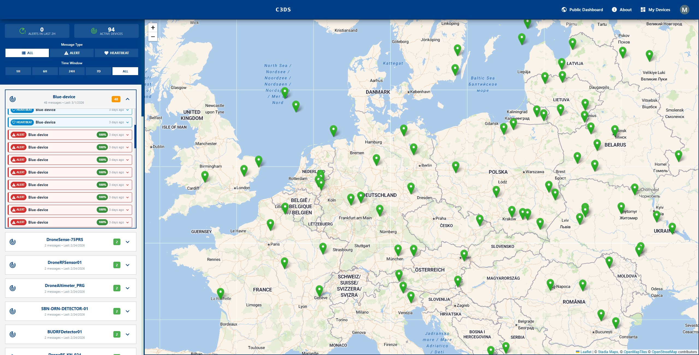
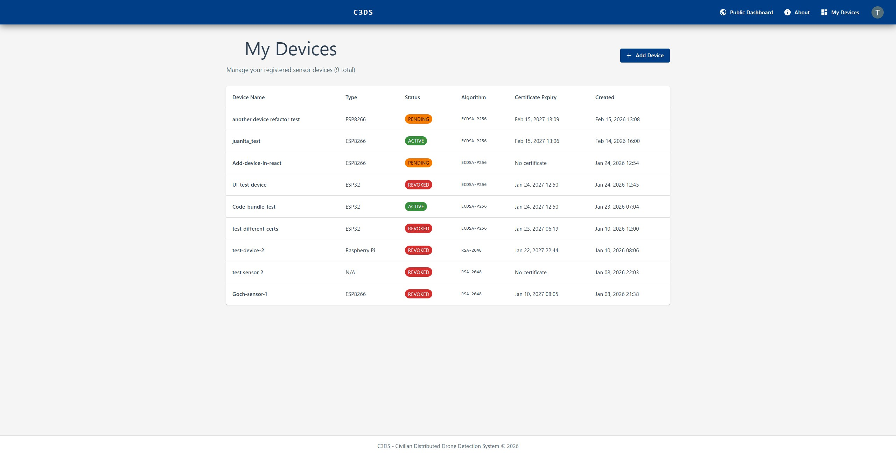
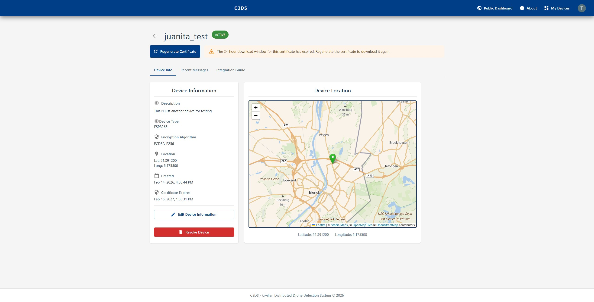
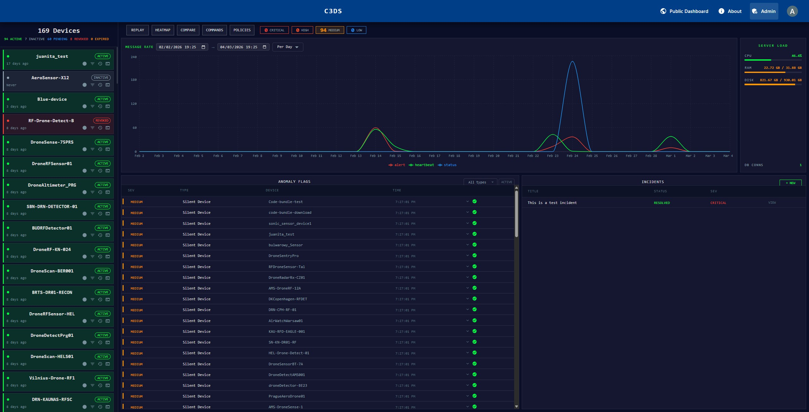
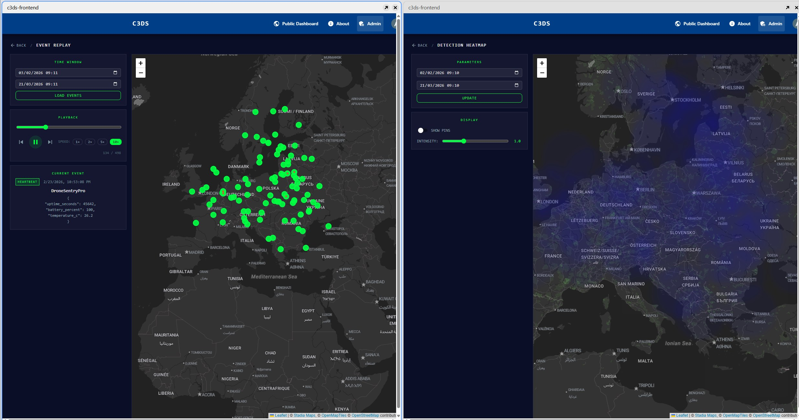
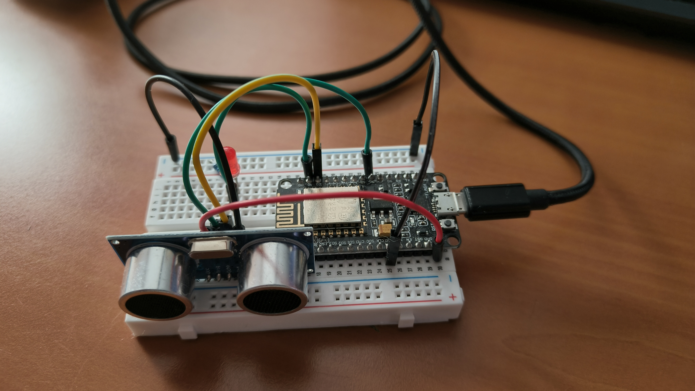
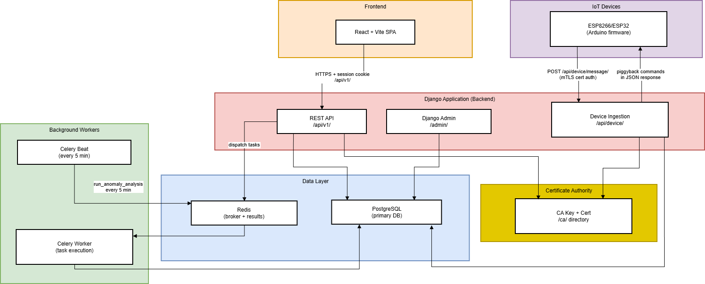
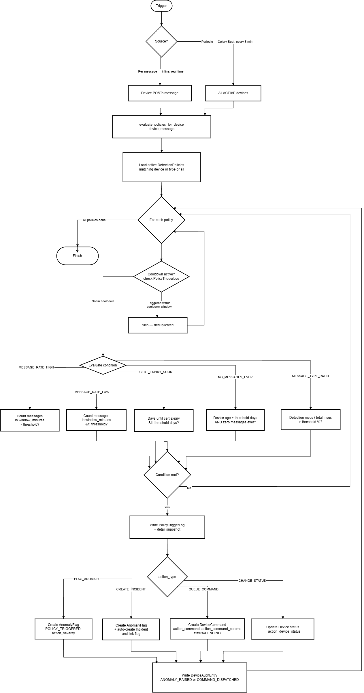
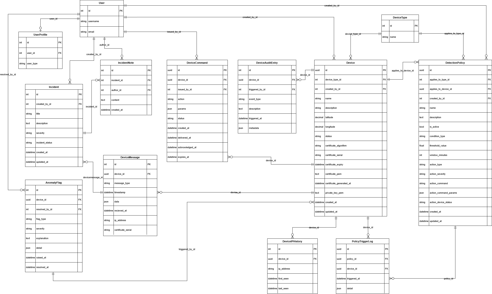

# C3DS — Civilian Distributed Drone Detection System

*Built as a final-year BSc Computer Science project for CM3040 Physical Computing and the Internet of Things; the brief called for a dashboard to onboard heterogeneous IoT devices under user-defined security policies, monitor their behaviour, and raise alerts or trigger actions.*

C3DS is a citizen-operated sensor network for spotting and tracking small drones. Volunteers run low-cost IoT sensors (RF detectors, ultrasonic rangefinders, and similar) that authenticate with per-device certificates and report detections to a central server. The server verifies every message cryptographically, runs a rule-based anomaly/policy engine over the incoming data, and surfaces everything through a public live map and an admin console for operators.

This repository is the **Django/DRF backend**: device onboarding and certificate lifecycle, signed-message ingestion, the anomaly detection and policy engine, incident tracking, and the REST API consumed by the frontend. The React frontend lives in a sibling `c3ds-frontend` repository and is built together with this backend for deployment (see [`build.sh`](build.sh)).

## Screenshots

**Public dashboard** — a live map of every reporting device across the network, with a filterable feed of alerts and heartbeats.



**Participant dashboard ("My Devices")** — a registered participant's own devices, their certificate status, and algorithm.



**Device detail** — a single device's info, location, certificate management (regenerate/download), and its integration guide.



**Admin dashboard** — network-wide device list, message-rate chart, live anomaly flags, incident tracker, and server health.



**Event replay & detection heatmap** — admin tools for scrubbing back through historical events on a map and visualising detection density over a time window.



**Reference sensor** — the ESP8266 + HC-SR04 prototype used to develop and test the device-side protocol.



## Features

- **Certificate-based device identity** — each device is issued an X.509 certificate (RSA or ECDSA) signed by a project-run CA; every ingested message is signature-verified against it (`apps/device_management`).
- **Signed message ingestion** — a single endpoint (`POST /api/device/message/`) accepts `alert`, `heartbeat`, and `status` messages from the field (`apps/data_processing`).
- **Rule-based anomaly & policy engine** — detects silent devices, message-rate spikes, authentication from unknown IPs, malformed messages, and user-defined policies (rate/cert-expiry/message-ratio conditions → flag, incident, status change, or queued device command), evaluated inline per-message and on a Celery Beat schedule (`apps/anomaly_detection`).
- **Incident workspace** — anomaly flags and detection events can be grouped into incidents with a chronological note log, for admins to investigate and resolve.
- **Remote device commands** — admins can queue `SET_INTERVAL`, `SET_THRESHOLD`, or `REBOOT` commands, delivered piggyback on the device's next message and acknowledged back by the device.
- **Public + participant + admin views** — a public live map, a "My Devices" console for participants, and a full operator dashboard with event replay and a detection heatmap.
- **Full audit trail** — device registration, status changes, certificate operations, and command dispatch/ack are all recorded (`DeviceAuditEntry`).

## Architecture

**System overview** — how the pieces fit together at runtime: the React SPA and Django admin talk to the DRF API over session auth, field devices POST signed messages to the ingestion endpoint (and collect any queued commands piggybacked on the response), Celery Beat and its worker run the scheduled anomaly analysis through Redis, and PostgreSQL plus the on-disk CA back the whole thing.



```
c3ds/                 ← this repo (Django backend)
├── apps/
│   ├── core/              User accounts, roles (admin / participant / non-participant)
│   ├── device_management/ Device registry, CA, certificates, ESP8266 reference firmware
│   ├── data_processing/   Signed message ingestion + command ack endpoint
│   ├── anomaly_detection/ Anomaly flags, incidents, detection policies, device commands
│   └── dashboard/         Aggregated stats for the dashboard views
└── config/                Django settings (dev = SQLite, prod = Railway/Postgres), Celery, URLs

c3ds-frontend/         ← sibling repo (React + Vite), built into apps/.../dist and served by Django
```

Detection policies are evaluated both inline (as messages arrive) and periodically via Celery Beat:



Data model (entities and relationships across all apps):



## Tech stack

| Layer | Technology |
|---|---|
| Backend | Django 4.2, Django REST Framework, drf-spectacular |
| Auth | Django session auth; per-device mutual certificate auth (RSA/ECDSA + SHA-256) |
| Database | SQLite (development), PostgreSQL (production, via `dj-database-url`) |
| Background jobs | Celery + Celery Beat (Redis broker) — periodic anomaly analysis |
| Frontend | React + Vite (separate `c3ds-frontend` repo), served as static files via WhiteNoise |
| Deployment | Railway (Nixpacks), Gunicorn |
| Reference hardware | ESP8266 (NodeMCU / Wemos D1 Mini) + HC-SR04, ECDSA P-256 signing |

## Getting started

### Prerequisites

- Python 3.11+
- Node.js + npm (for the frontend, in the sibling `c3ds-frontend` repo)
- Redis (only needed to run the Celery Beat anomaly-analysis worker)

### Backend setup

```bash
git clone https://github.com/Pavelosky/c3ds.git
cd c3ds

python -m venv venv
source venv/bin/activate        # Windows: venv\Scripts\activate
pip install -r requirements.txt

python manage.py migrate
python manage.py create_ca      # generates the local device certificate authority
python manage.py createsuperuser

python manage.py runserver
```

By default `manage.py` uses `config.settings.development` (SQLite, `DEBUG=True`, CORS open to the Vite dev server on `localhost:5173`). The Django admin is at `/admin/`, the API at `/api/v1/`, and interactive API docs (Swagger UI) at `/api/docs/`.

### Frontend setup

The frontend is a separate repository, expected as a sibling directory (`../c3ds-frontend` relative to this repo) so the backend's build/static-file config can find it:

```bash
cd ..
git clone https://github.com/Pavelosky/c3ds-frontend.git
cd c3ds-frontend
npm install
npm run dev
```

### Background workers (optional)

Anomaly analysis also runs on a 5-minute schedule via Celery Beat, in addition to the inline per-message checks:

```bash
celery -A config worker -B -l info
```

## Connecting a device

- [`docs/device-integration-guide.md`](docs/device-integration-guide.md) — the wire protocol: message format, certificate/signature headers, step-by-step signing instructions, and server validation/response reference. Applies to any device, in any language.
- [`apps/device_management/device_templates/ESP8266_sensor/`](apps/device_management/device_templates/ESP8266_sensor/) — a concrete reference implementation (Arduino firmware + wiring guide) for an ESP8266 + HC-SR04 ultrasonic sensor, as pictured above.

## Security notes

- Devices authenticate with mutual certificate auth: `X-Device-Certificate` and `X-Device-Signature` headers, verified against the project CA (see the integration guide for details).
- The CA's private key and issued device keys/certificates are never committed (`ca/`, `*.pem`, `*.key`, `*.crt` are gitignored) — regenerate the local CA with `python manage.py create_ca`.
